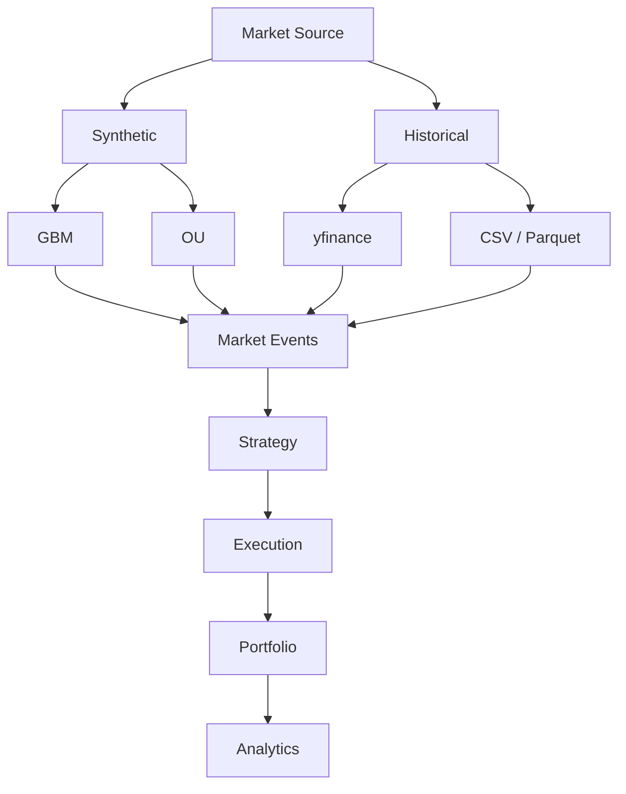
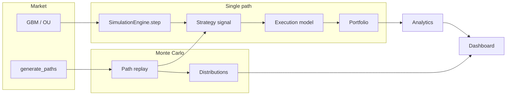

# Alpha

Research simulator for **algorithmic trading strategies** on **stochastic price paths** and **historical OHLCV data**.

Alpha is a Python engine plus a Streamlit dashboard. It generates geometric Brownian motion and Ornstein–Uhlenbeck paths, replays real historical market data, runs long-only strategies through a cost-aware execution layer, and reports path-wise, backtest, and Monte Carlo statistics.

Price paths are **simulated**, not forecasts. Results are **not investment advice**.

## Screenshot


On first load the app runs a default demo: **$100,000** capital, **$100** spot, **252** daily steps, **GBM** (μ = 8%, σ = 20%), **10/30 moving-average crossover**, **100 shares** per entry, **5 bps commission / 2 bps slippage / 1 bp half-spread**, seed **42**.

```bash
streamlit run app.py
```

## Features

- Exact GBM and OU discretizations, vectorized multi-path generation
- **Historical OHLCV backtesting** (yfinance, CSV, Parquet) with local cache
- Strategies: MA crossover, z-score mean reversion, buy-and-hold (signal-only; no portfolio mutation)
- Same-bar fills (synthetic) or **next-bar-open** fills (historical)
- Commission (bps), slippage/spread, and square-root market impact with rolling ADV / vol
- Frictionless vs realistic comparison on an **identical** seeded path
- Analytics: total return, CAGR, vol, Sharpe, drawdown series, round-trip trade stats
- Monte Carlo: GBM/OU paths, **historical bootstrap** (IID and block)
- Buy-and-hold benchmark over the same historical period
- Step / Start / Reset **simulated** real-time mode (not a live market feed)
- Streamlit + Plotly research UI with Synthetic / Historical market source selector

## Market data modes

### Synthetic

GBM and OU generate controlled stochastic paths for Monte Carlo and sensitivity analysis. Useful when you need many independent scenarios under explicit model assumptions.

### Historical

Real OHLCV data is ingested, normalized, cached locally (`data/raw/`), and replayed one bar at a time through the **same** strategy → execution → portfolio → analytics stack. Rolling historical ADV and realized volatility feed the market-impact model when enabled.

### Historical bootstrap

Empirical log returns are resampled (IID or block) to construct alternative price paths. This complements GBM/OU Monte Carlo by drawing from observed return distributions rather than parametric assumptions.



**Execution timing (historical):** strategy observes the **close** of bar *t*, signals are generated, and orders fill at the **open** of bar *t+1* (default). Synthetic mode retains same-bar close fills for backward compatibility.

**Observed vs modeled:** daily OHLCV provides price and volume; spread, slippage, and market impact remain **configured assumptions**, not historical quotes.

**Adjusted prices:** when available, use `adjusted_close` for marks and returns; raw OHLC is preserved separately. Do not mix adjusted and unadjusted series silently.

See [Limitations](#limitations) below.

## Architecture



Data flow: a price model either **steps** one observation or **emits a path matrix**. The engine turns each price into a strategy signal, an order, a fill (with optional frictions), and a portfolio mark. Monte Carlo vectorizes path generation, then replays each row through **fresh** strategy / portfolio / execution objects.

## Mathematical models

**Geometric Brownian motion** (exact log step)

\[
dS_t = \mu S_t\,dt + \sigma S_t\,dW_t,
\quad
S_{t+\Delta t}=S_t\exp\bigl[(\mu-\tfrac12\sigma^2)\Delta t+\sigma\sqrt{\Delta t}\,Z\bigr]
\]

`mu` and `sigma` use the **same time unit as** `1/dt`. The dashboard sets `dt = 1/252`, so both are **annualized**.

**Ornstein–Uhlenbeck**

\[
dX_t=\theta(\mu-X_t)\,dt+\sigma\,dW_t
\]

`theta` is per unit time (per year if `dt=1/252`). `sigma` is the **level** diffusion of `X`, not a return volatility. `X` can be non-positive; the portfolio requires a positive mark, so use GBM for price-like assets.

**Returns and risk** (equity \(E_t\))

- Period return \(r_t=E_t/E_{t-1}-1\)
- Total return \(E_T/E_0-1\)
- Annualized return: CAGR \((1+R)^{P/n}-1\) with \(P=252\)
- Annualized vol: \(\mathrm{std}(r_t, \mathrm{ddof}=1)\sqrt{P}\)
- Sharpe: \(\sqrt{P}\cdot\mathrm{mean}(r_t-r_f/P)/\mathrm{std}(r_t)\) — arithmetic excess returns, **not** CAGR / vol
- Drawdown: \(E_t/\max_{s\le t}E_s-1\)

**Execution**

- Commission: `bps × 1e-4 × |qty| × execution_price` (cash)
- Slippage + half-spread: BUY pays mid × (1 + k), SELL receives mid × (1 − k), `k` in decimal from bps
- Slippage is **in the fill price** (inventory / cash). The TCA field `total_transaction_cost` reports commission + slippage notional; cash is not charged slippage twice
- Fills are **same-bar** (signal and fill on the newly revealed price). That is slightly optimistic vs next-bar fills; it is not peeking at future bars

## Example usage

```python
from alpha.execution import SimpleExecutionModel
from alpha.market import GeometricBrownianMotion
from alpha.portfolio import Portfolio
from alpha.simulation import SimulationEngine
from alpha.strategies import MovingAverageCrossover

engine = SimulationEngine(
    model=GeometricBrownianMotion(s0=100.0, mu=0.08, sigma=0.20, dt=1 / 252),
    portfolio=Portfolio(initial_capital=100_000.0),
    strategy=MovingAverageCrossover(10, 30, trade_quantity=100.0),
    execution=SimpleExecutionModel.realistic(commission_bps=5.0, slippage_bps=2.0),
    seed=42,
)
result = engine.run(n_steps=252)
print(result.final_equity, result.n_trades, result.total_transaction_costs)
```

Monte Carlo:

```python
from alpha.execution import ExecutionConfig
from alpha.simulation import MonteCarloSimulator

mc = MonteCarloSimulator(
    model_factory=lambda: GeometricBrownianMotion(s0=100.0, mu=0.08, sigma=0.20, dt=1 / 252),
    strategy_factory=lambda: MovingAverageCrossover(10, 30, trade_quantity=100.0),
    execution_config=ExecutionConfig(commission_bps=5.0, slippage_bps=2.0, spread_bps=1.0),
    initial_capital=100_000.0,
)
print(mc.run(n_paths=1_000, n_steps=252, seed=42).summary())
```

## Dashboard

```bash
python -m venv .venv
source .venv/bin/activate          # Windows: .venv\Scripts\activate
pip install -e ".[dev]"
streamlit run app.py
```

Open the URL Streamlit prints (typically http://localhost:8501).

This is a **simulated** market. Start / Step / Reset advance the local engine; they do not connect to a broker.

## Monte Carlo

Paths are drawn independently (`shape = (n_paths, n_steps)`) from one NumPy RNG stream. Each path is replayed with a **new** strategy, portfolio, and execution model. Identical `seed` values reproduce the path matrix and the metrics. Aggregates are mean, median, std, and 5th / 25th / 75th / 95th percentiles of finite samples.

## Execution / friction

TCA here is a **parametric mid-to-fill adjustment**, not a limit-order book, queue, or market-impact econometric fit to live fills.

**Existing frictions**

- **Commission** — explicit cash fee (bps of executed notional)
- **Half-spread** — simple bid/ask proxy applied adversely to mid
- **Fixed slippage** — additional bps adverse move vs mid (execution uncertainty)

**Market impact (optional)**

Square-root approximation for research simulation:

\[
I = \eta \,\sigma_{\text{daily}}\,\sqrt{\frac{Q}{V}},
\quad
\sigma_{\text{daily}} = \frac{\sigma_{\text{annual}}}{\sqrt{252}}
\]

- \(\eta\) — impact coefficient (configurable)
- \(Q\) — order quantity (shares)
- \(V\) — average daily volume (shares/day liquidity proxy)

Impact is applied **after** spread and fixed slippage. BUY pays more; SELL receives less. Participation rate \(Q/V\) is stored on each fill.

For synthetic GBM/OU paths, set **manual ADV** in the dashboard. When historical volume exists, use `rolling_adv()` (no look-ahead) — volume series support is not yet wired into the price models.

**Limitations:** empirical approximation only; no LOB, no order slicing, no intraday volume curve, no venue microstructure. ADV is a simplified liquidity proxy.

## Benchmarks

Re-run on your machine (numbers below are from one local run of this script; they are not guarantees):

```bash
python benchmarks/bench_alpha.py
```

Measured on this machine (Python 3.13.5, NumPy 2.5.2, arm64; `time.perf_counter`, best of 3 where the script repeats):

| Workload | Result |
|---|---|
| GBM 10,000 paths × 1,000 steps | 0.1448 s · 69.1M price points / s |
| OU 10,000 paths × 1,000 steps | 0.1394 s · 71.7M points / s |
| Engine HoldStrategy, frictionless, 20,000 steps | **159,227 updates / s** · exceeds 100 updates/s: **YES** |
| Engine MA crossover + realistic costs, 20,000 steps | 134,212 updates / s |
| Monte Carlo 1,000 paths × 252 steps | 1.6314 s · 613 paths / s |
| Monte Carlo 10,000 paths × 252 steps | 15.2311 s · 657 paths / s |

Path generation is vectorized NumPy. Monte Carlo wall time is dominated by **Python per-path replay** (fresh strategy / portfolio / execution each path). cProfile on 200 MC paths: most time is `Portfolio.snapshot` / `SimulationEngine.step`, not SDE generation.

## Project structure

```
src/alpha/
  market/        GBM, OU, path replay
  strategies/    MA, mean reversion, buy-and-hold
  execution/     orders, fills, bps costs
  portfolio/     cash, inventory, P&L
  simulation/    step engine, Monte Carlo
  analytics/     returns, Sharpe, drawdown
  dashboard/     Streamlit UI (calls the modules above)
app.py
benchmarks/bench_alpha.py
tests/
```

## Tests

```bash
pytest
```

Coverage is aimed at **financial logic**: identities, costs, look-ahead, resets, edge markets—not a line-count target.

## Limitations

- Single tradable; long-only by default
- Synthetic mode uses same-bar close fills; historical mode uses next-bar-open by default
- Daily OHLCV does not contain the order book; spread/slippage/impact are **modeled**, not observed
- No latency, queue position, partial fills, or intraday execution (unless intraday data is added later)
- OU used as a “price” can go non-positive
- Sharpe uses daily simple returns; compounding vs arithmetic will differ from CAGR
- Historical provider data may contain revisions, survivorship bias, and corporate-action quirks
- Past backtest success does not predict future results; parameter tuning can overfit
- Dashboard Monte Carlo is capped so the browser stays usable
- Not institutional-grade market data or a live trading system

## Disclaimer

Alpha is an **educational / research** project. Simulated paths are not predictions. Transaction-cost assumptions are simplified. Nothing here is investment advice, an offer to trade, or a production execution platform.
